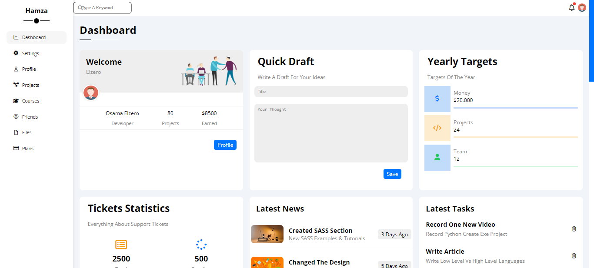

# Resposive Dashbord

- Live Preview: Access a live preview of the dashboard [here](https://ess-maker.github.io/dashbord/)
- 
Dashbord is a web project that provides a dashboard interface with multiple pages.

## Features

- Responsive design to support various screen sizes
- Multiple pages:
  - `index.html`: Home page
  - `courses.html`: Courses page
  - `files.html`: Files page
  - `friends.html`: Friends page
  - `profile.html`: Profile page
  - `projects.html`: Projects page
  - `settings.html`: Settings page
  - `plans.html`: Plans page

## Getting Started

To use or contribute to this project, follow these steps:

1. Clone the repository:
2. git clone https://github.com/ess-maker/dashbord.git

2. Open any of the HTML files in a web browser to view the corresponding page.

## Customization

You can customize the dashboard by modifying the HTML and CSS files for each page. The CSS styles can be found in the `styles.css` file. Feel free to customize the design, layout, and content to suit your needs.

## Folder Structure

The project has the following structure:

- `index.html`: Home page
- `courses.html`: Courses page
- `files.html`: Files page
- `friends.html`: Friends page
- `profile.html`: Profile page
- `projects.html`: Projects page
- `settings.html`: Settings page
- `plans.html`: Plans page
- `styles.css`: CSS styles for the project
- `images/`: Directory for storing images used in the project

## Contributing

Contributions are welcome! If you find any issues or have suggestions for improvements, please open an issue or submit a pull request.

## License

This project is licensed under the [MIT License](LICENSE).
